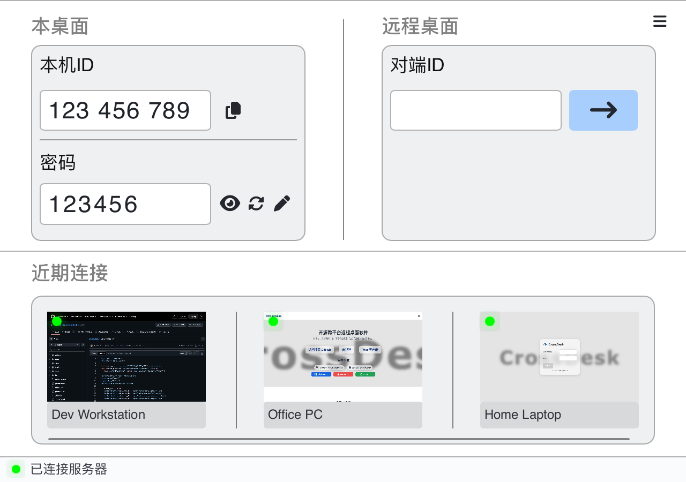
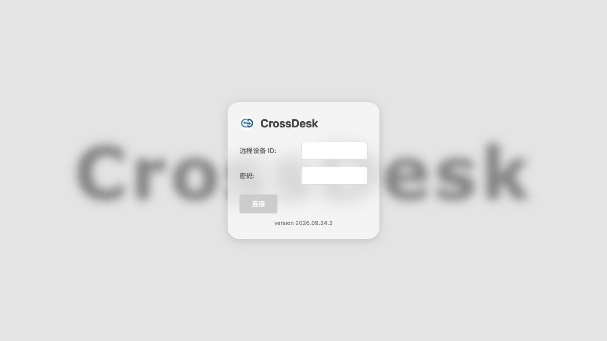
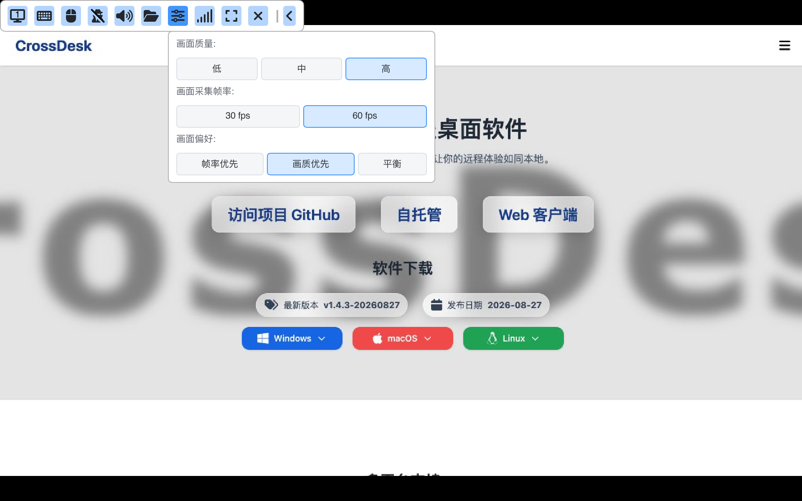
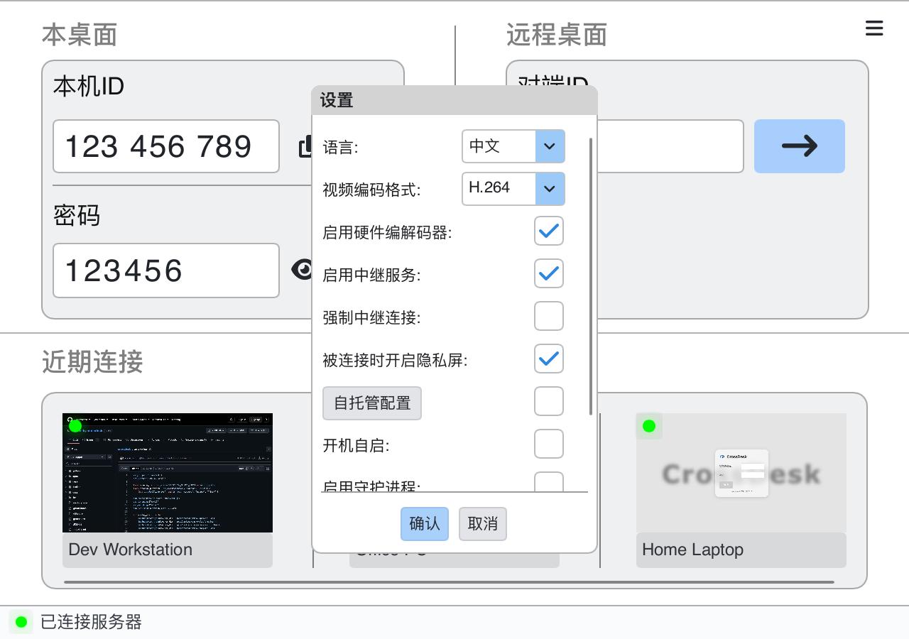
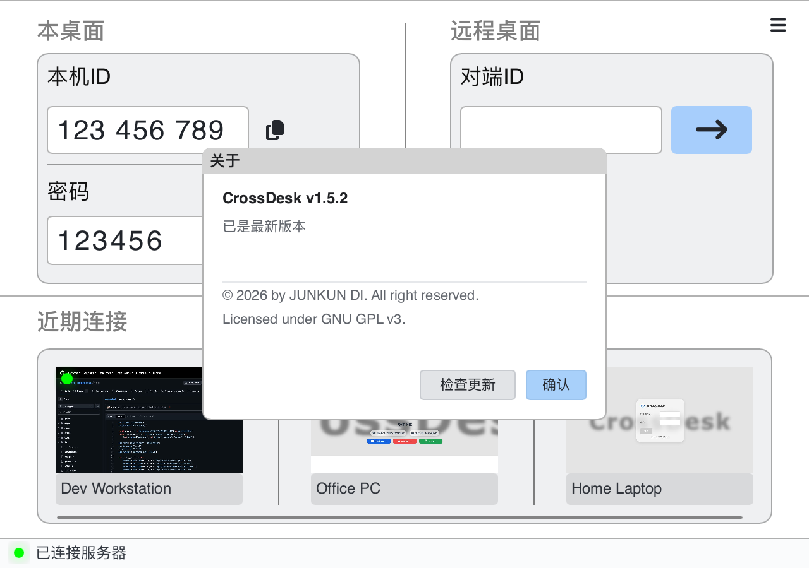

<div align="center">
  
  <h1>CrossDesk</h1>
  <p>轻量、跨平台的远程桌面，让电脑、浏览器和 iPhone / iPad 连接到同一张桌面。</p>
  <p><a href="https://www.crossdesk.cn/">官方网站</a> · <a href="https://github.com/kunkundi/crossdesk/releases">下载客户端</a> · <a href="https://web.crossdesk.cn/">打开 Web 客户端</a> · <a href="README_EN.md">English</a></p>
</div>

<div align="center">

[](#download)
[](https://github.com/kunkundi/crossdesk/releases)
[](https://github.com/kunkundi/crossdesk/actions/workflows/build.yml)
[](LICENSE)
[](https://github.com/kunkundi/crossdesk/stargazers)

</div>

CrossDesk 支持 Windows、macOS、Linux 之间的远程访问，也可从浏览器或原生 iOS 客户端控制电脑。项目基于 [MiniRTC](https://github.com/kunkundi/minirtc)，提供实时音视频传输、键鼠控制、文件传输与自托管能力，仍在持续开发中。

> 本文按当前仓库代码整理。截图展示当前 Slint 桌面界面，使用演示 ID、密码、在线状态和连接记录；缩略图来自公开页面；下载包的功能与系统要求请同时核对对应 Release 说明。原生 iOS 客户端的构建、签名方式见下文。

[界面预览](#preview) · [下载与安装](#download) · [快速连接](#quick-start) · [会话操作](#session) · [设置](#settings) · [iOS](#ios) · [自托管](#self-hosting) · [源码构建](docs/BUILD.md) · [常见问题](docs/FAQ.md)

<a id="preview"></a>

## 界面预览

### 桌面客户端

主窗口集中展示本机 ID、连接密码、远程连接入口和近期连接记录。

<p align="center">
  
</p>

### Web 客户端

在浏览器中输入远程设备 ID 和密码，无需在控制端安装桌面客户端。

<p align="center">
  
</p>

图片来源与更新方式见 [截图说明](docs/images/README.md)。

## 主要功能

| 能力 | 当前支持 |
| --- | --- |
| 跨平台控制 | Windows / macOS / Linux 桌面互控；浏览器与原生 iOS 作为控制端 |
| 实时画面与声音 | H.264 / AV1、硬件编解码、远端声音播放；会话中可调整画质、30 / 60 fps 与画面偏好 |
| 多设备与多显示器 | 近期连接、设备别名、会话标签与远端显示器切换 |
| 输入与协作 | 键鼠输入、远端光标同步、组合键、文本剪贴板同步、文件传输 |
| 网络与部署 | P2P 直连、TURN 中继与强制中继、SRTP 媒体加密、自托管信令与中继服务 |
| 隐私屏 | 被连接时自动开启，或在会话工具栏切换；可用性取决于被控端系统与采集方式 |
| Windows 锁屏控制 | 通过 CrossDesk Service 支持锁屏、登录界面及安全桌面的输入转发 |
| Linux 无头运行 | 复用已有桌面和应用，或创建独立 Xvfb 虚拟桌面；终端控制台可查看状态、修改密码和设置，见 [运行说明](docs/HEADLESS.md) |

各客户端的入口和能力有所不同；桌面会话操作见下文，iOS 的具体功能见 [开发说明](apps/ios/README.md)。

<a id="download"></a>

## 下载与安装

前往 [GitHub Releases](https://github.com/kunkundi/crossdesk/releases) 或 [官方网站](https://www.crossdesk.cn/)，按系统与 CPU 架构选择安装包。

| 平台 | 当前源码 / CI 基线 | 安装方式 |
| --- | --- | --- |
| Windows | Windows 10+，x64 | `.exe` 安装包；便携构建也受支持 |
| macOS | macOS 14.0+，Intel / Apple Silicon | 选择 x64 或 arm64 的 `.pkg` |
| Linux | Ubuntu 20.04+，amd64 / arm64，glibc 2.31 基线 | `.deb` 安装包 |
| iOS / iPadOS | iOS 16.0+，arm64 真机 | 原生客户端；使用 Xcode 构建并签名，CI 产物为未签名应用 |
| Web | 支持 WebRTC 的浏览器 | 访问 [web.crossdesk.cn](https://web.crossdesk.cn/) |

Linux 下载后，在下载目录中将文件名替换为实际安装包名称：

```bash
sudo apt install "./crossdesk-linux-amd64-<version>.deb"
```

**macOS 首次运行：** 按应用提示，在“系统设置 → 隐私与安全性”中授予 CrossDesk **屏幕录制**（新系统可能显示为“屏幕与系统音频录制”）及 **辅助功能**权限，再按系统提示重新打开应用。前者用于捕获桌面，后者用于远程键鼠输入。

<a id="quick-start"></a>

## 快速连接

### 从另一台电脑连接

1. **准备被控电脑。** 安装并运行 CrossDesk，等待底部显示“已连接服务器”。在左侧“本桌面”查看 **本机 ID** 和 **密码**，提供给控制端。
2. **输入对端 ID。** 在控制端右侧“远程桌面 → 对端 ID”输入被控电脑的 ID，点击 **→**。
3. **完成密码验证。** 按弹窗输入被控电脑当前的连接密码，确认后等待远程画面出现。需要保存密码时勾选“记住密码”。
4. **再次连接。** 成功连接过的设备会出现在“近期连接”中，可通过卡片重连，也可编辑别名或删除记录。

本机密码旁的眼睛按钮用于显示 / 隐藏密码，刷新按钮用于生成新的随机密码，铅笔按钮用于手动修改。密码统一为 **6 位数字或英文字母**。修改或刷新时需保持连接服务器；等待修改成功、客户端重新连接后，再复制当前密码。已保存旧密码的控制端需重新输入。

### 从浏览器连接

1. 保持被控电脑上的 CrossDesk 运行，并确认已连接服务器。
2. 打开 [Web 客户端](https://web.crossdesk.cn/)，输入 **远程设备 ID** 和 **密码**，点击“连接”。
3. 连接后使用页面提供的显示器、鼠标模式和键盘控件操作远端；手机和平板也可通过浏览器访问。

如果使用自建服务器，需要让控制端与被控端接入同一服务；Web 部署配置见 [CrossDesk Web Client](https://github.com/kunkundi/crossdesk-web-client)。

<a id="session"></a>

## 会话中的常用操作

远程窗口通过会话标签切换设备，控制栏提供以下操作；控制栏收起时先点击展开按钮。将鼠标悬停在图标上可查看提示。

| 入口 | 用途 |
| --- | --- |
| 显示器 | 切换远端显示器 |
| 键盘 | 发送组合键；Windows 的 `Ctrl+Alt+Del` 依赖远端服务 |
| 鼠标 | 控制 / 释放远端鼠标 |
| 扬声器 | 播放声音 / 静音 |
| 文件夹 | 选择文件发送到远端，并查看传输进度 |
| 画面设置 | 在当前会话中调整画面质量、采集帧率与画面偏好 |
| 网络状态 | 查看流量、丢包率、帧率、分辨率、直连 / 中继及加密状态 |
| 隐私屏 | 开启或关闭被控电脑的隐私屏；悬停查看当前状态与可用操作 |
| 全屏 | 进入 / 退出全屏 |
| 断开连接 | 结束当前远程会话 |

桌面端可同步文本剪贴板。接收文件的位置可在“设置 → 文件保存路径”调整。关闭主窗口会隐藏窗口并保持程序运行；需要完全退出时使用系统托盘或菜单栏中的退出入口。

### 在会话中调整画面

连接成功后，点击工具栏中的 **画面设置**（滑杆图标），直接选择低 / 中 / 高画质、**30 / 60 fps**，以及帧率优先 / 画质优先 / 平衡。选项会发送给当前被控端，无需断开重连；实际画面效果取决于网络、设备与编码器能力。旧版被控端不支持时，菜单会提示并禁用选项。

<p align="center">
  
</p>

<a id="settings"></a>

## 客户端设置与更新

点击主窗口右上角 **☰ → 设置**，修改后点击“确认”保存。编码与连接选项建议在建立连接前调整；会话进行中部分选项不可修改。设置列表可向下滚动，查看自托管、启动方式与文件保存路径。画质、帧率和画面偏好在远程会话工具栏中调整。

<p align="center">
  
</p>

| 设置 | 说明 |
| --- | --- |
| 语言 | 中文、English、Русский |
| 采集方式（Windows） | 自动 / DXGI / WGC / GDI；无显示器主机使用“自动”启用自动适配 |
| 视频编码格式 | H.264 / AV1；硬件编解码是否可用取决于平台、硬件与构建选项 |
| 启用中继服务 | 允许借助 TURN 中继建立连接；P2P 连接失败时先检查此项 |
| 强制中继连接 | 启用中继服务后可勾选，让连接通过中继建立；关闭中继服务会同时关闭此项 |
| 被连接时开启隐私屏 | 设置本机被远程连接时是否自动启用隐私屏；会话中可从控制端工具栏切换 |
| 自托管配置 | 填写服务器地址和信令服务端口，并勾选启用 |
| 开机自启 / 启用守护进程 | 调整启动与进程守护行为，按界面提示重启后生效 |
| 文件保存路径 | 选择接收文件的目录 |

### 检查更新

客户端启动后会在后台检查版本。发现新版本时，主窗口菜单入口会显示更新提示；打开 **☰ → 关于** 可查看版本，也可点击 **检查更新** 手动检查。发现更新后可查看更新说明并前往下载页面。

<p align="center">
  
</p>

<a id="ios"></a>

## 原生 iOS / iPadOS 客户端

仓库的 [`apps/ios`](apps/ios/README.md) 提供原生控制端，与桌面端使用同一套 MiniRTC 协议。它可以控制远端电脑；当前不提供将 iPhone / iPad 作为被控桌面的功能。

1. 按 [iOS 开发说明](apps/ios/README.md) 使用 Xcode 构建并签名，安装到 iOS 16+ 的真机。
2. 在首页输入对端 ID，点击连接并填写密码；成功连接后可从“最近连接”中重连。
3. 在设置中选择鼠标模式：**相对位置**像触控板一样移动光标，**绝对位置**将触摸位置直接映射到远端画面。
4. 点击悬浮图标展开菜单，可切换显示器、显示键盘、控制声音或发送文件。收到的文件位于应用的 `Documents/Received`，可通过传输状态旁的分享按钮导出。

当前支持接收远端文本到 iOS 剪贴板；界面暂未提供主动发送本机剪贴板的按钮。

当前支持单指点击、双指右键、长按拖动与捏合缩放；缩放后的双指平移用于移动视图。原生端与浏览器端分别维护，使用入口和手势可能不同。

<a id="windows-service"></a>

## Windows 锁屏与登录界面

**CrossDesk Service**（服务名 `CrossDeskService`）提供锁屏、登录、凭据输入及安全桌面的状态上报、`Ctrl+Alt+Del` 发送和键鼠输入转发。

安装版会注册按需启动的服务，客户端启动时尝试启动它；本机没有 CrossDesk 客户端进程后服务会自动退出。便携版可在提示窗口或“设置 → 锁屏控制服务”中安装服务，需要管理员权限。该服务依赖客户端运行。

<details>
<summary>手动部署与服务管理命令</summary>

保留完整安装目录；自行部署构建产物时，将 `CrossDesk.exe`、`crossdesk_service.exe`、`crossdesk_session_helper.exe` 及同次构建输出的全部 `.dll` 放在同一目录。在该目录打开管理员 PowerShell，按需执行：

```powershell
.\CrossDesk.exe --service-install
.\CrossDesk.exe --service-start
.\CrossDesk.exe --service-status
.\CrossDesk.exe --service-ping
# 停止或卸载服务
.\CrossDesk.exe --service-stop
.\CrossDesk.exe --service-uninstall
```

</details>

出现“远端 Windows 服务不可用”时，检查被控电脑的安装和服务状态；普通桌面连接仍可使用，受保护界面的控制能力会受限。

<a id="self-hosting"></a>

## 自托管服务器

可自行部署信令服务与 TURN 中继，并在桌面客户端 **☰ → 设置 → 自托管配置** 中填写连接信息。控制端与被控端都需要启用同一套配置。

- [自托管指南](docs/SELF_HOSTING.md)：当前 Compose 部署入口、客户端设置、证书信任与排查。
- [CrossDesk Server](https://github.com/kunkundi/crossdesk-server)：服务端源码与发布配置。
- [CrossDesk Web Client](https://github.com/kunkundi/crossdesk-web-client)：浏览器端源码与自托管说明。

## 开发与反馈

- [源码构建](docs/BUILD.md)：Windows、macOS、Linux、可选编译参数与打包。
- [iOS 开发说明](apps/ios/README.md)：原生端构建和真机验证。
- [GUI 架构](docs/gui-architecture.md)：桌面 UI、平台实现与工程结构。
- [常见问题](docs/FAQ.md)：连接失败、黑屏、文件位置与编译问题。
- [提交问题](https://github.com/kunkundi/crossdesk/issues)：请附上两端系统、客户端版本、连接方式和可复现步骤。

## 致谢与许可

感谢 [HelloGitHub](https://hellogithub.com/)、[阮一峰的科技爱好者周刊](https://github.com/ruanyf/weekly) 与 [LinuxDo](https://linux.do) 社区的推荐、交流与支持。

CrossDesk 使用 [GPL-3.0](LICENSE) 许可。隐私说明见 [隐私政策](PRIVACY.md#中文)。

### Code signing policy

CrossDesk 使用 SignPath.io 为本仓库构建的官方 Windows 发布包提供代码签名。

**Free code signing provided by [SignPath.io](https://signpath.io/), certificate by [SignPath Foundation](https://signpath.org/).**

- **Committers and reviewers（代码提交与审核）：** [kunkundi](https://github.com/kunkundi)
- **Approvers（签名审批）：** [kunkundi](https://github.com/kunkundi)
